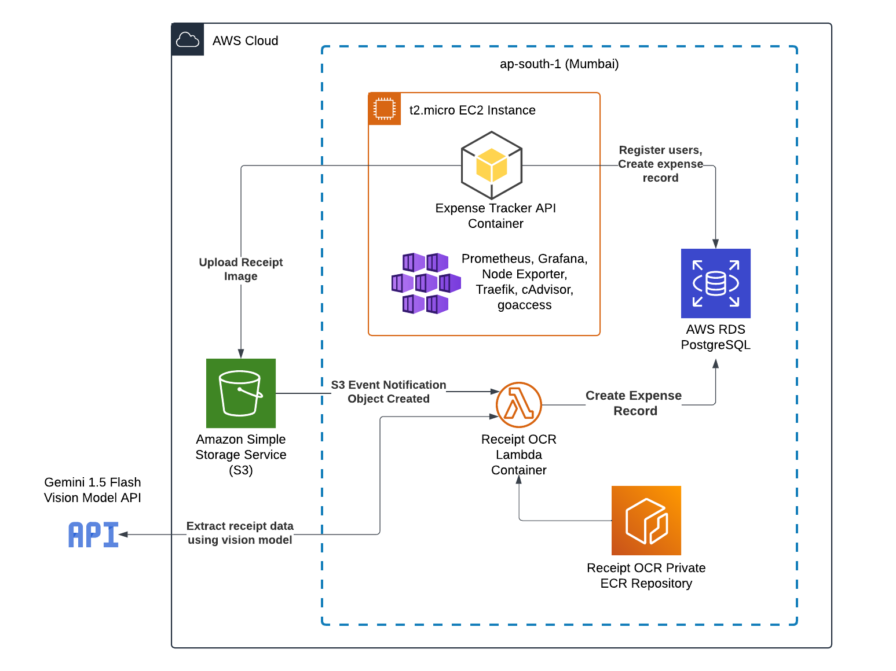

<!DOCTYPE html>
<html lang="en">
<head>
    <meta charset="UTF-8">
    <meta name="viewport" content="width=device-width, initial-scale=1.0">
    <title>LedgerlyXprojectWing</title>
</head>
<body>
    <
        <h2><u>LedgerlyXprojectWing </u> </h2>
           
        <section>
        
            <h2><u>PROJECT ARCHITECTURE (CLOUD)</u></h2>
            
              <h1> Git Repository for the project Ledgerly.</h1>
        
        </section>
        
            <h2>MLSA</h2>
        

        
            <li>CLOUD </li> 
           <li> UI/UX</li>
            <li>
            APP</li>
            <li>CYBER SECQURITY
            </li>

  

   

</body>
</html>

